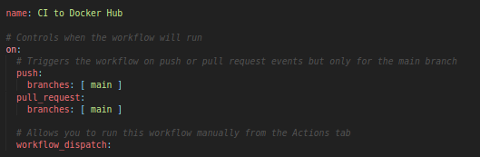
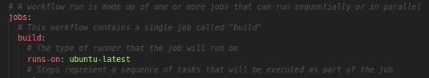
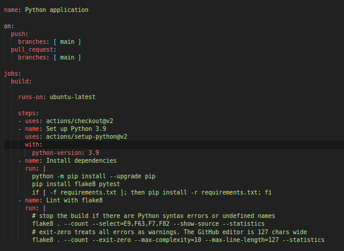
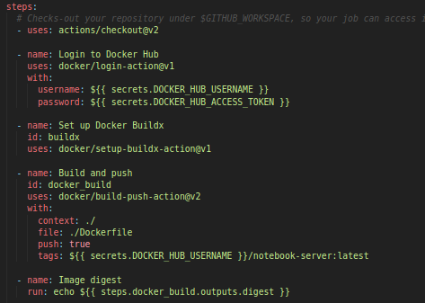
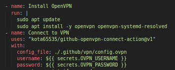
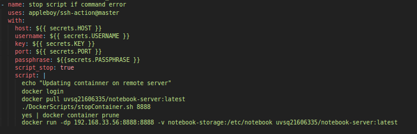

# Documentation du processus de déploiement :
## Importation des données dans la base:
Pour importer les données dans la base à l'aide de notre ETL, nous devons d'abord fournis les droits SUPERUSER à l'utilisateur piratage.
Pour cela, nous avons effectué les commandes suivantes:
``` bash
    root@pg:~# sudo -i -u postgres psql
    postgres=# ALTER USER "piratage" with superuser;
```

Il nous suffit ensuite d'éxécuter l'etl avec la configuration de notre choix:

``` bash
    python3 pipeline.py
```
Le fichier de configuration au format .json se trouve dans  
## Installation de docker sur le serveur Webapp:
### Commandes d'installation:
Les commandes suivantes permettent l'installation des prérequis, de la clé GPG , de l'ajout du dépot de package Docker au sources APT et enfin l'instalation et la vérification de cette dernière:

``` bash
    root@webapp:~# sudo apt update
    root@webapp:~# sudo apt install apt-transport-https ca-certificates curl gnupg2 software-properties-common
    root@webapp:~# curl -fsSL https://download.docker.com/linux/debian/gpg | sudo apt-key add -
    root@webapp:~# sudo add-apt-repository "deb [arch=amd64] https://download.docker.com/linux/debian $(lsb_release -cs) stable"
    root@webapp:~# apt-cache policy docker-ce
    root@webapp:~# sudo apt install docker-ce
```


Une fois le moteur de conteneur Docker installé, il est nécessaire de configurer le proxy pour construire l'image du conteneur sur le serveur, nous avons suivi le tutoriel officiel sur le site de [docker](https://docs.docker.com/config/daemon/systemd/#httphttps-proxy)


## Connexion et récuperation des images:
Les images correspondantes au serveur du Jupyter Notebook et à l'application Web(Dashboard), ont été construites sur ma machine locale, puis hébérgés sur DockerHub.

*  [Notebook-server](https://hub.docker.com/repository/docker/uvsq21606335/notebook-server)
*  [Dashboard-piratage](https://hub.docker.com/repository/docker/uvsq21606335/dashboard-piratage)


Sur le serveur WebApp, la récupération des images et le lancement des conteneurs se fait à l'aide de la commande suivante:

``` bash
    root@webapp:~# docker login
    root@webapp:~# docker pull uvsq21606335/dashboard-piratage:latest
    root@webapp:~# docker pull uvsq21606335/notebook-server:latest
```


## Déploiement manuel:
On exécute ensuite les images avec :

``` bash
   #Création d'un volume de stockage pour rendre le stockage des notebooks persistants d'un conteneur à l'autre 
   root@webapp:~# docker volume create notebook-storage
   root@webapp:~# docker run -dp 192.168.33.56:8888:8888 -v notebook-storage:/etc/notebook uvsq21606335/notebook-server:latest
   root@webapp:~# docker run -dp 192.168.33.56:8050:8050 uvsq21606335/dashboard-piratage:latest
```

## Accès aux differents services:

Depuis le réseau privé de l'université, il est possible d'accèder au services via le navigateur de votre choix, en entrant les liens ci dessus dans la barre de recherche :

* [Notebook](192.168.33.56:8888)
* [Dashboard](192.168.33.56:8050)

L'accès au serveur notebook requiert un token d'authentification qui est généré à chaque déploiement d'une nouvelle version de l'image, il reste accessible depuis les fichiers logs par la commande suivant où ID représentes l'identifiant du conteneur:

``` bash
   root@webapp:~# docker logs --tail 3 [ID]
```


## Intégration continue et déploiement continu:
### Motivations:
Les besoins fonctionnels du dashboard pouvant évoluer en fonction des besoins de l'analyse, nous avons décidé d'implémenter un *pipeline* d'intégration et de déploiement continu qui repose sur Docker et Github Actions.

L'intégralité des outils étant écrit avec le langage Python, cela simplifie grandement la mise en place des *actions* réutilisables.


## Intégration continue:
Dans Github Action, une operation de CI/CD est représentée par un fichier [.yml](https://yaml.org/spec/history/2001-05-26.html), qui spécifie à quel moment du pipeline (push on Master, Pull Request on Master ...) l'action doit être effectuée, ainsi que les étapes à suivre pour la réalisation de celle ci (Checkout, build,etc...)



Dans le vocabulaire de Github Action, un ficher yml correpond à un *job*, lui même composé des attibuts build et *steps*, qui spécifient respectivement l'environnement cible (Ex: Ubuntu-latest) et la suite d'étapes à réaliser pour effectuer ce *job*.
Les *steps* peuvent reposer sur des plugins officiels (Ex: github/checkoutV2), des plugins tiers (cf: ssh-action et openvpn) ou sur des commandes personalisés.
Chaque *steps* peut être composé d'un nom (name), d'une descrption (description), d'un attribut 
*uses* suivi du nom du plugin pour préciser qu'il repose sur un plugin (Officiel ou tier) ou d'un attribut *run* suivi d'une suite de commande à éxécuter sur le serveur de CI/CD.



Deux *jobs* sont pour le moment implémentés pour gérer les operations de CI et CD, une description détaillée des scripts est réalisée dans les sections suivantes.

Le fichier [python-app.yml](https://github.com/piratage-ter/Dashboard_TER/blob/main/.github/workflows/python-app.yml) est responsable de l'operation d'intégration continue pour un projet python.
Il se décompose comme suit: 

* actions/checkout@v2 : Se place au dernier commit.
* actions/setup-python@v2 : Met en place un environnement python 
*  pip install flake8 pytest: Installe Flake8 (Linter) et pytest (Framework de test unittaires)
* flake8 . --count --select=E9,F63,F7,F82 --show-source --statistics: Analyse le code à la recherche d'erreurs de syntaxe, de variables non déclarés et autres erreurs dans le style de programmation.
* pytest : Execute les tests unitaires



Une fois tous les tests au vert, la pull request est accepté et la fusion effectuée, dans le cas contraire un mail de notification est envoyé à l'initiateur du Push ou de PR pour l'avertir d'une erreur dans le processus d'intergration continue.

## Déploiement continu:
### Création de l'image Docker:
Suite à l'éxécution des tests d'intégration, une seconde operation est déclenchée par le script [build-docker-image.yml](https://github.com/piratage-ter/Dashboard_TER/blob/main/.github/workflows/build-docker-image.yml), elle se compose des étapes suivantes:


* actions/checkout@v2 : Se place au dernier commit.
* docker/login-action@v1 : Se connecte a DockerHub avec les identifiants (Nom d'utilisateur et token d'accès) 
* docker/setup-buildx-action@v1 : Met en place l'environement pour la construction de l'image.
* docker/build-push-action@v2 : Construit l'image selon les régles du Dockerfile et l'hébérge sur Dockerhub.


### Déploiment sur le serveur WebApp:

Une fois l'image créée et hébérgée sur DockerHub, il faut autoriser Github Actions à se connecter au VPN de l'université et éxécuter une série de commandes à distance.
Cette partie du déploiement repose sur deux plugins tiers que sont [ssh-action](https://github.com/appleboy/ssh-action) et [OpenVPN-connect](https://github.com/marketplace/actions/openvpn-connect)




L'utilisation du module [ssh-action]() permet de connecter le pipeline au serveur distant avec le protocole ss. Les informations sont transmises au script en utilisant le mécanisme des *secrets* , qui permettent de stocker des informations sensibles tels que les tokens d'accès et les clés privés. Elle sont transmises au pipeline en utilisant la syntaxe suivante:
``` yml
    ${{secrets.NOM_DU_SECRET}}
```



Les commandes bash éxécutés à distance, vont lancer le processus de *mise à jour* du conteneur en le remplacant par la version possédant le tag **latest**.
